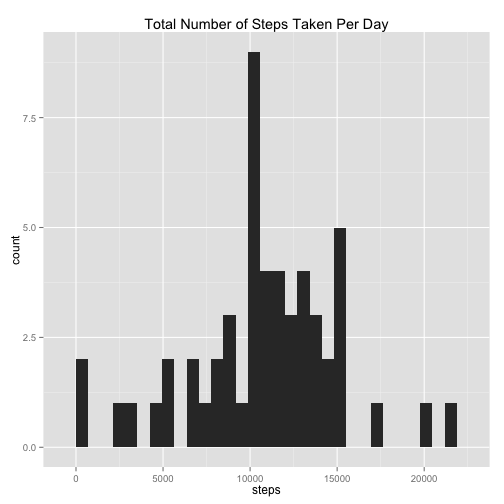
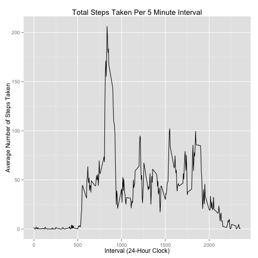
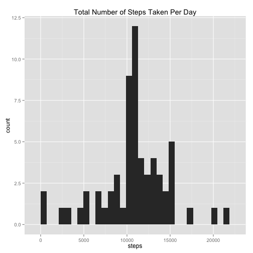
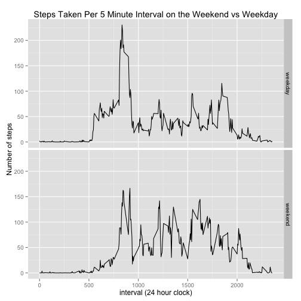

# Introduction

It is now possible to collect a large amount of data about personal
movement using activity monitoring devices such as a
[Fitbit](http://www.fitbit.com), [NikeFuelband](http://www.nike.com/us/en_us/c/nikeplus-fuelband),
or [Jawbone Up](https://jawbone.com/up). These type of devices are part of
the "quantified self" movement -- a group of enthusiasts who take
measurements about themselves regularly to improve their health, to
find patterns in their behavior, or because they are tech geeks. But
these data remain under-utilized both because the raw data are hard to
obtain and there is a lack of statistical methods and software for
processing and interpreting the data.

This assignment makes use of data from a personal activity monitoring
device. This device collects data at 5 minute intervals through out the
day. The data consists of two months of data from an anonymous
individual collected during the months of October and November, 2012
and include the number of steps taken in 5 minute intervals each day.

## Loading and preprocessing the data


```r
if (!file.exists("./activity.csv")){
  download.file(
		"https://d396qusza40orc.cloudfront.net/repdata%2Fdata%2Factivity.zip",
		destfile = "./repdata-data-activity.zip",
		method = "curl"
  )

	unzip("./repdata-data-activity.zip")
}

data <- read.csv("activity.csv")
```

## What is mean total number of steps taken per day?


```r
library(ggplot2)

total_steps <- tapply(data$steps, data$date, sum )

qplot(
  total_steps,
  binwidth = 706,
  xlab="steps"
) +
ggtitle("Total Number of Steps Taken Per Day")
```

 

##### Calculate and report the mean and median total number of steps taken per day


```r
mean(total_steps, na.rm=TRUE)
```

```
## [1] 10766
```

```r
median(total_steps, na.rm=TRUE)
```

```
## [1] 10765
```


## What is the average daily activity pattern?


```r
library(ggplot2)

averages <- aggregate(
              x=list(steps=data$steps),
              by=list(interval=data$interval),
              mean,
              na.rm=TRUE
            )

ggplot(
  data=averages,
  aes(x=interval, y=steps)
) +
geom_line() +
ggtitle("Total Steps Taken Per 5 Minute Interval") +
xlab("Interval (24-Hour Clock)") +
ylab("Average Number of Steps Taken")
```

 

##### Which 5-minute interval, on average across all the days in the dataset, contains the maximum number of steps?


```r
averages[which.max(averages$steps),]
```

```
##     interval steps
## 104      835 206.2
```

## Imputing missing values

##### Calculate and report the total number of missing values in the dataset (i.e. the total number of rows with NAs)


```r
missing <- is.na(data$steps)
table(missing)
```

```
## missing
## FALSE  TRUE 
## 15264  2304
```

##### Devise a strategy for filling in all of the missing values in the dataset.

All missing values are filled in with mean value for that 5-minute interval.

##### Create a new dataset that is equal to the original dataset but with the missing data filled in.


```r
fill_value <- function(steps, interval) {
    filled <- NA
    if (!is.na(steps))
        filled <- c(steps)
    else
        filled <- (averages[averages$interval==interval, "steps"])
    return(filled)
}
filled_data <- data
filled_data$steps <- mapply(fill_value, filled_data$steps, filled_data$interval)
```
##### Make a histogram of the total number of steps taken each day and Calculate and report the mean and median total number of steps taken per day. Do these values differ from the estimates from the first part of the assignment? What is the impact of imputing missing data on the estimates of the total daily number of steps?


```r
total_steps <- tapply(filled_data$steps, filled_data$date, sum)

qplot(
  total_steps,
  binwidth=706,
  xlab="steps"
) +
ggtitle("Total Number of Steps Taken Per Day")
```

 

```r
mean(total_steps)
```

```
## [1] 10766
```

```r
median(total_steps)
```

```
## [1] 10766
```

The median value is higher after imputing missing data because the method chosen to impute the data is replacing NA values with averages so the median should naturally move towards the mean.

## Are there differences in activity patterns between weekdays and weekends?

##### Create a new factor variable in the dataset with two levels – “weekday” and “weekend” indicating whether a given date is a weekday or weekend day.


```r
weekday_test <- function(date) {
    day <- weekdays(date)
    if (day %in% c("Monday", "Tuesday", "Wednesday", "Thursday", "Friday"))
        return("weekday")
    else if (day %in% c("Saturday", "Sunday"))
        return("weekend")
    else
        stop("invalid date")
}
filled_data$date <- as.Date(filled_data$date)
filled_data$day <- sapply(filled_data$date, weekday_test)
```

##### Make a panel plot containing a time series plot (i.e. type = "l") of the 5-minute interval (x-axis) and the average number of steps taken, averaged across all weekday days or weekend days (y-axis).


```r
averages <- aggregate(steps ~ interval + day, data=filled_data, mean)
ggplot(
  averages,
  aes(interval, steps)
) +
geom_line() +
facet_grid(day ~ .) +
ggtitle("Steps Taken Per 5 Minute Interval on the Weekend vs Weekday") +
xlab("interval (24 hour clock)") +
ylab("Number of steps")
```

 
